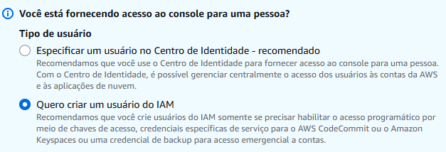

# Configuração conta AWS

A conta **AWS Free Tier** é a recomendada para fins didáticos, sem custo por até 06 meses (dependendo do serviço). 

É  solicitado cartão de crédito/débito no cadastro, necessário para verificar identidade; não há cobrança se os limites do Free Tier forem respeitados. 

**Plano de suporte**: selecionar o plano básico (gratuito), suficiente para iniciantes. 

**Usuário root**: criado automaticamente ao abrir a conta. Não usar no dia a dia, apenas para tarefas administrativas: 

* Alterar informações da conta;

* Fechar a conta AWS;

* Ativar ou desativar o MFA do root;

* Gerenciar assinaturas de suporte;

* Solicitar aumento de limites de serviço;

**Segurança**: ativar MFA no root e utilizá-lo somente quando necessário. 

**Usuário administrador IAM**: criar um usuário separado para todas as ações do dia a dia, com permissões apropriadas. 

:rotating_light: _**Importante**: na criação do novo usuário será recomendado a opção de usar o **Identity Center (AWS Single Sign-On)**, que caso seja habilitado, pode ativar recursos não gratuitos e gerar cobranças. Com isso, deve-se seguir com a opção não recomendada, pelo **IAM Clássico**, sem usar o Identity Center._

**Região padrão**: escolher uma região próxima (ex. São Paulo para usuários no Brasil) melhora latência e performance. 

**Email e senha**: usar um email exclusivo para a conta AWS e senha forte, garantindo segurança. 

**Organização inicial**: criar tags nos recursos (como “estudo” ou “teste”) para identificar e controlar melhor os gastos. 

**Controle de custos**: configurar alertas de gastos por e-mail e definir limites de gastos para evitar surpresas. 

Para maiores informações, consulte o site da [AWS](https://aws.amazon.com/pt/free/).

