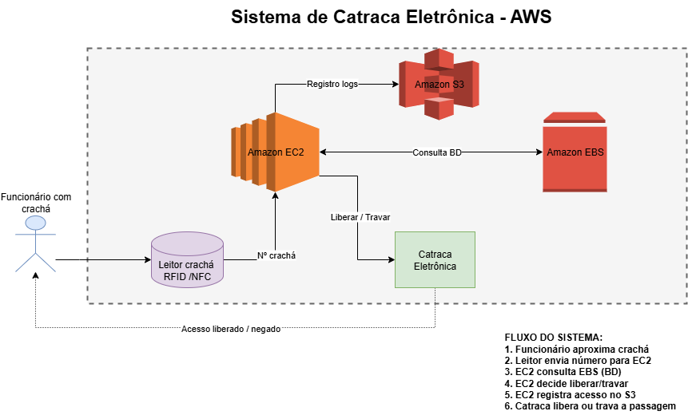

# Primeiro desafio de projeto: Arquitetura AWS utilizando EC2, EBS e S3.

O primeiro desafio de projeto é a criação de um diagrama de arquitetura AWS que utilize os serviços estudados até aqui.

Com isso, foi criado um sistema de controle de entrada de um edifício comercial, com catraca eletrônica e leitor de crachás.

### Fluxo de acesso

* **Fluxo normal** 

:one: Funcionário aproxima crachá do leitor;  
:two: Leitor -> EC2: envia número do crachá para validação;  
:three: EC2 -> EBS: consulta banco de funcionários ativos;  
:four: EC2: verifica permissões;  
:five: EC2 -> Catraca: "ACESSO LIBERADO";  
:six: EC2 -> S3: Registra acesso do funcionário;  
:seven: Catraca libera passagem.  

* **Fluxo negado**   

:one: Funcionário aproxima crachá do leitor;  
:two: Leitor -> EC2: envia número do crachá para validação;  
:three: EC2 -> EBS: consulta banco de funcionários ativos e não localiza;  
:four: EC2 -> Catraca: "ACESSO NEGADO";  
:five: EC2 -> S3: Registra tentativa de acesso do funcionário;  
:six: Catraca permanece travada.  

## Diagrama arquitetura AWS

