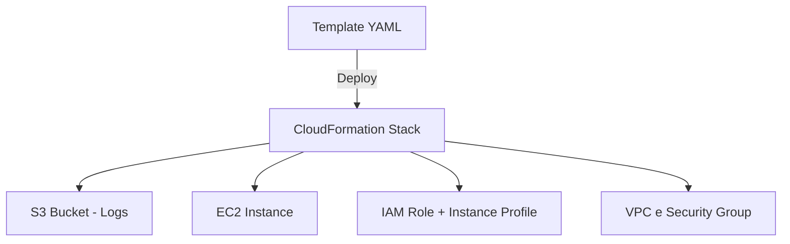

# Quinto desafio de projeto: Automação de Infraestrutura AWS (Lambda, S3) 

<div align="justify">

### :dart: Objetivo do Desafio 

O objetivo deste projeto é demonstrar a automação de infraestrutura na AWS utilizando o CloudFormation, aplicando na prática os conceitos de Infraestrutura como Código (IaC). 
A proposta é criar e gerenciar recursos AWS — como instâncias EC2, buckets S3 e papéis IAM — por meio de templates em YAML, garantindo reprodutibilidade, versionamento e controle da infraestrutura. 

### :gear:  Recursos e Tecnologias Utilizadas 

|Recurso/Tecnologia | Finalidade |
|-------------------|------------|
**AWS CloudFormation**|Automação da criação e gerenciamento dos recursos AWS via templates YAML.
**Amazon EC2**|Instância de servidor virtual para simulação de ambiente.
**Amazon S3**|Armazenamento de logs e arquivos de acesso.
**AWS IAM**|Controle de permissões e papéis (roles/policies).
**LocalStack**|Simulação local dos serviços AWS para desenvolvimento e testes.
**Docker Compose**|Orquestração do ambiente LocalStack em contêiner.
**AWS CLI**|Interface de linha de comando para interagir com os serviços AWS.  

### :jigsaw: Arquitetura da Solução 

A infraestrutura definida via CloudFormation cria e conecta os seguintes componentes: 

* Um **bucket S3** para logs de acesso; 

* Uma **função IAM (Role)** com permissões limitadas de acesso; 

* Uma **instância EC2** simulando um servidor de controle de acesso; 

* Todos os recursos são orquestrados por uma **stack CloudFormation**, o que permite fácil criação, atualização e exclusão da infraestrutura completa.

### :world_map: Diagrama da Solução 




###  :bricks: LocalStack 

LocalStack é uma plataforma que simula serviços da AWS localmente. 
Com ele, é possível criar, testar e destruir recursos AWS sem custos e sem depender de uma conta real na nuvem — ideal para desenvolvimento e aprendizado. 

Principais usos: 

* Testar templates CloudFormation sem precisar acessar a AWS real; 

* Desenvolver pipelines de infraestrutura com segurança; 

* Integrar testes automatizados de IaC em CI/CD pipelines; 

* Simular S3, EC2, Lambda, DynamoDB, IAM, CloudFormation, entre outros serviços suportados. 

### LocalStack implementado neste projeto 

O ambiente foi configurado com Docker Compose, incluindo os serviços necessários (S3, EC2, IAM e CloudFormation). 

```yaml
version: '3.8' 

  

services: 

  localstack: 

    image: localstack/localstack:latest 

    container_name: localstack 

    ports: 

      - "4566:4566" 

    environment: 

      - SERVICES=s3,ec2,iam,cloudformation 

      - DEBUG=1 

      - DEFAULT_REGION=us-east-1 

    volumes: 

      - "./localstack_data:/tmp/localstack" 

      - "/var/run/docker.sock:/var/run/docker.sock" 
```

Após a execução com: 

```bash
docker-compose up -d  
```

é possível usar os comandos: 

```bash
aws --endpoint-url=http://localhost:4566 cloudformation create-stack \ 

  --stack-name desafio-cloudformation \ 

  --template-body file://template.yaml 
```

e simular toda a infraestrutura localmente. 

### :cloud: Conceitos Aplicados 

* **Infraestrutura como Código (IaC)**  
Toda a infraestrutura é descrita em um arquivo YAML versionável. 

* **Automação e Reprodutibilidade**  
O mesmo template pode ser aplicado em diferentes ambientes (dev, test, prod). 

* **Isolamento e Teste Local**  
Com o LocalStack, foi possível validar o funcionamento dos templates sem custos. 

* **Boas práticas AWS**  
Uso de Roles e Policies, controle de acesso e estrutura modular de templates.  

### :bookmark_tabs: Resultado Final 

Com o template e o ambiente configurados, é possível: 

:heavy_check_mark: Criar a infraestrutura automaticamente via CloudFormation;  
:heavy_check_mark: Simular a AWS localmente com LocalStack;  
:heavy_check_mark: Versionar toda a estrutura no GitHub;  
:heavy_check_mark:  Deletar e recriar stacks de forma limpa e controlada;  

### :end: Conclusão 

Este projeto demonstra como **CloudFormation** e **LocalStack** podem ser combinados para construir um fluxo completo de automação de infraestrutura — desde o código até o ambiente executável. 
Com essa abordagem, é possível **garantir eficiência, segurança e consistência** na criação de recursos AWS, além de reduzir custos e riscos durante o desenvolvimento.  
**Em resumo:** o desafio consolida habilidades práticas em IaC, automação e versionamento de ambientes na nuvem — pilares essenciais para profissionais de Cloud e DevOps. 

</div>